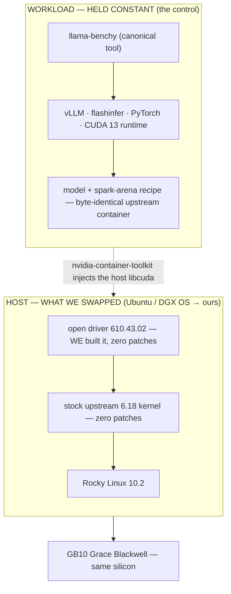

# spark-rocky — the 30-second proof

**The NVIDIA DGX Spark (GB10) runs on a clean RHEL-family stack — Rocky Linux 10.2 + a stock upstream 6.18
kernel + the open NVIDIA driver 610.43.02, with _zero source patches_ — and reproduces published
[spark-arena.com](https://spark-arena.com) single-host benchmarks at parity.**

> **Reproduced at parity, third-party-verifiable — _not_ "faster."** Parity is the whole point: the only thing
> we change is the *host* (OS + kernel + driver). Per-axis deltas above 1.0× track the one uncontrolled
> variable (spark-arena pins no vLLM version), not the swap.

## Reproduced — 5 single-host models

| Model | Published `tg128 c1` | Ours | Result |
|---|---:|---:|---|
| Qwen3.5-35B-A3B-FP8 | 50.75 | 56.2 | **full 104-cell matrix · median 1.01× = parity** |
| Qwen3.5-0.8B | 121.2 | 123.0 | **full 104-cell matrix · median 0.96× = parity** |
| gemma-3-1b-it | 91.0 | 101.9 | **full matrix (56-cell) · median 1.05× = parity** |
| LFM2.5-350M | 222.8 | 246.0 | single-cell `tg128 (c1)` · +10.4% |
| gpt-oss-120b | 58.8 | 62.6 | single-cell `tg128 (c1)` · 1.06× &dagger; |

Three reproduced across the **full `llama-benchy` matrix** (median = parity); two at single-cell `tg128 (c1)`.
Every number has a committed raw receipt → [`receipts/`](receipts/) · detail → [`docs/scoreboard.md`](docs/scoreboard.md).
&dagger; The 120B's full matrix is gated by *desk-appliance cooling*, not the stack — the single cell proves the
stack runs a 120B single-host.

## Why it matters — three things, all checkable

1. **Zero source patches.** No `.patch`/`.diff` exists anywhere in the repo. The only kernel input we author is
   a `.config` (GB10 enablement — configuration, not code); the open driver is built unmodified in an el10 container.
2. **Firmware-current, the standard way.** The box runs NVIDIA's latest platform firmware via **stock public
   `fwupd`/LVFS** — no DGX OS, no entitlement, no proprietary tool. The same firmware a DGX OS box runs, so the
   parity result carries no firmware confound.
3. **Staying current is a one-line change.** Bump the kernel in [`config/versions.env`](config/versions.env)
   and rebuild — validated `6.18.34 → 6.18.35` end-to-end. A *stock-mainline* kernel means a version bump is a
   config change, not a patch-rebase that rots.

## What we changed vs. held constant

The result is honest because the benchmark runs inside a container we did **not** touch. We swapped only the
host *below* the container boundary; everything the workload executes lives *above* it, held constant.

**Control:** the byte-identical workload container, built from the upstream project's own Dockerfile.
**Witness:** the independent spark-arena scoreboard. We replaced the host beneath that container and the
published numbers came back at parity.

→ **Reproduce or refute any entry yourself** (credential-free): [`docs/reproduce-pipeline.md`](docs/reproduce-pipeline.md).
