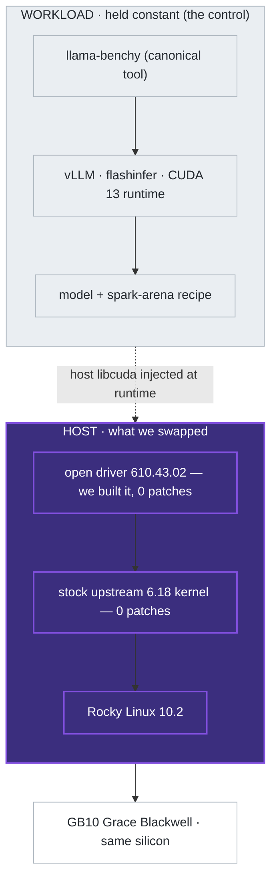

# spark-rocky — the 30-second proof

> **A clean RHEL-family stack runs NVIDIA's DGX Spark — zero source patches — and matches the community's own benchmark scoreboard.**
> Rocky Linux 10.2 + a stock upstream 6.18 kernel + the open NVIDIA driver 610.43.02, measured against published [spark-arena.com](https://spark-arena.com) single-host entries. **Reproduced at parity — _not_ "faster."**

The claim is the **capability** — Rocky runs the box, the host carries zero source patches, the firmware is current through stock public tooling. The numbers are the **evidence**, not a speed result.

## We swapped only the host. The workload never moved.

*The benchmark container is byte-identical upstream — built from the project's own Dockerfile, untouched. We replaced the host beneath it (the dark layer); the published numbers came back at parity.*

## The parity proof — three full-matrix models

A full `llama-benchy` matrix sweeps the whole performance surface: **decode** (token generation, the single-user case), **prefill** (prompt processing), and **concurrency** (aggregate throughput as users stack up). There is no single "valuable" cell — single-user workloads care about decode, serving cares about throughput at high concurrency, long-context cares about the deep-depth cells. The honest summary of the whole surface is its **median** vs 1.0× (parity); within it, decode lands at or just above parity and prefill slightly below (~0.75–0.79×).

| Model | Scope | Full-matrix median vs published |
|---|---|:---:|
| Qwen3.5-35B-A3B-FP8 | full 104-cell matrix | **1.01× — parity** |
| Qwen3.5-0.8B | full 104-cell matrix | **0.96× — parity** |
| gemma-3-1b-it | full 56-cell matrix (context-capped) | **1.05× — parity** |

Three medians spanning **0.96×–1.05×** — straddling parity is the signature of a transparent host swap. Raw per-cell numbers + the prefill/decode breakdown are committed: [`receipts/`](receipts/) · [`docs/scoreboard.md`](docs/scoreboard.md).

**Also reproduced — single-cell `tg128 (c1)` only; a parity claim requires the full matrix:**

| Model | Published | Ours | State |
|---|---:|---:|---|
| LFM2.5-350M | 222.8 | 246.0 | single cell — full matrix not yet run |
| gpt-oss-120b | 58.8 | 62.6 | single cell — **full matrix in progress** ⏳ ([#6](https://github.com/maxspevack/spark-rocky/issues/6)) |

⏳ The 120B's full matrix is gated by desk-appliance cooling, not the stack. The single cell does prove one thing: the zero-patch stack serves a 120B model single-host on the GB10.

## Why it holds up — all three checkable

- ✅ **Zero source patches.** No `.patch`/`.diff` exists anywhere in the repo. The only kernel input we author is a `.config` (GB10 enablement — configuration, not code); the open driver is built unmodified in an el10 container.
- ✅ **Firmware-current, the standard way.** NVIDIA's latest platform firmware via **stock public `fwupd`/LVFS** — no DGX OS, no entitlement, no proprietary tool. The same firmware a DGX OS box runs, so the parity result carries no firmware confound.
- ✅ **Staying current is a one-line change.** Bump the kernel in [`config/versions.env`](config/versions.env) and rebuild. A *stock-mainline* kernel means a version bump is a config change, not a patch-rebase that rots — `6.18.35` is validated to boot and bring up the GPU; the benchmarks here ran on `6.18.34`.

→ **Reproduce or refute any entry yourself, credential-free:** [`docs/reproduce-pipeline.md`](docs/reproduce-pipeline.md)
