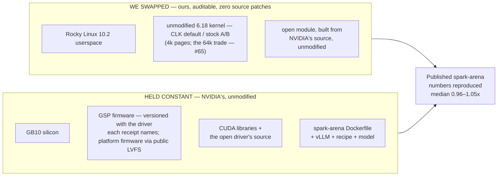

# A standard Rocky Linux stack on the CIQ Linux Kernel runs NVIDIA's DGX Spark — at single-host inference parity, and you can confirm it yourself

> Rocky 10.2 + the CIQ Linux Kernel (the shipped default; stock kernel.org 6.18 stays the always-live
> A/B knob) + NVIDIA's open driver, on the GB10, reproduces the community's own
> [spark-arena.com](https://spark-arena.com) single-host benchmarks. Every host change is auditable,
> the stack stays current through stock public tooling, and the published numbers came back.

## The proof

A full `llama-benchy` matrix sweeps the whole performance surface — **decode** (single-user
generation), **prefill** (prompt processing), and **concurrency** (throughput as users stack up). No
single cell is "the" number; the honest summary is the **full-matrix median vs 1.0× (parity)**.

| Model | Scope | Measured | Median vs published |
|---|---|---|:---:|
| Qwen3.5-35B-A3B-FP8 | full 104-cell matrix | 2026-06-10 | **1.01× — parity** |
| Qwen3.5-0.8B | full 104-cell matrix | 2026-06-10 | **0.96× — parity** |
| Qwen3.5-0.8B — gen-2 pinned runtime | full 104-cell matrix | **2026-07-24** | **1.010× — parity holds** |
| gemma-3-1b-it | full 56-cell matrix (context-capped) | 2026-06-10 | **1.05× — parity** |

Every row is a dated measurement backed by a committed receipt in [`receipts/`](../../receipts/) —
receipt filenames carry their dates. Numbers in this repo are never undated; if you find one, treat
it as a bug. Medians spanning **0.96×–1.05×** straddle parity: the signature of a transparent host
swap. The June prefill deficit (0.75–0.93× at `pp2048`) closed to 1.011× once the runtime was pinned
— it was vLLM version drift, not the host ([#18](https://github.com/maxspevack/spark-rocky/issues/18)
tracks the one residual cell class).

**The frontier holds too.** On the board's meta as of 2026-07-25 — NVFP4 quantization + MTP speculative
decoding — the same host runs the board's own top recipes receipt-grade: **Qwen3.6-35B-A3B**
statistically indistinguishable from the board's single-node field (zero throttle samples across all
28 official cells), and **Nemotron-3-Super-120B** — NVIDIA's flagship for this hardware — at a
statistical tie with the board-best single-node entry (23.57 ± 1.74 vs 23.71 t/s on `tg128 (c1)`, 2026-07-25/26), with
the MTP mechanism decomposed against a measured no-MTP baseline. The decomposition restates the
parity thesis: every resolvable movement was serving config (checkpoint format +48%, speculative
depth +19%), never the host. Full grids, variance reads, and the cooling boundary:
[`scoreboard.md`](scoreboard.md).

## We changed only the host

The benchmark runs in a serving container built from the spark-arena project's **own Dockerfile,
unmodified** (vLLM + the model + the spark-arena recipe). We swapped only the **host beneath it**,
and the host's `libcuda` is injected into that container at runtime. Same Dockerfile, same recipe,
same GB10 silicon.

One variable differed between the published runs and the June receipts: **the vLLM build, not the
host** — spark-arena pins no runtime version. Closed from our side 2026-07-24: the serving image is
pinned to a permanent dated [`spark-arena/dgx-vllm`](https://github.com/spark-arena/dgx-vllm) mirror
tag ([`config/serving-images.env`](../../config/serving-images.env), #71), and the full 0.8B matrix
on that pinned runtime lands **median 1.010×** (receipt
`reproduce-Qwen3.5-0.8B-gen2-2026-07-24.txt`). The parity claim survives the runtime catching up.

## What the host is

Everything swapped in is stock, current, and built from source. The coordinates are **pinned, not
prose**: [`config/versions.env`](../../config/versions.env) is the single source of truth for the
kernel commit, driver version, and page size — this page deliberately repeats none of them (a
hardcoded copy here has rotted before). The booted kernel states its own lineage: `uname -r` ends
`-clk`. Two standing facts with receipts:

- **Pages are 4k, a measured trade, not a preference.** 64k faults ≥4 GiB GPU allocations on the
  pinned driver branch ([`config/versions.env`](../../config/versions.env)) — an NVIDIA DMA-submap misalignment we root-caused and filed
  ([open-driver #1269](https://github.com/NVIDIA/open-gpu-kernel-modules/issues/1269), ours: [#65](https://github.com/maxspevack/spark-rocky/issues/65)).
  The one branch clean under 64k measured **10.4% slower** at identical page size (2026-07-31
  receipt). A fail-closed gate (`DRIVER_64K_SAFE`) holds the 64k direction until the driver is fixed.
- **CUDA — the layer that actually moves inference numbers — is held identical** to the stack the
  published entries ran on, so parity is a property of the OS/kernel/driver swap, not a CUDA
  artifact. Parity is not superiority.

## Why it holds up

- **Auditable.** Every host change is a named `.config` symbol, boot parameter, or build step —
  zero source patches, CI-enforced ([`platform-deltas.md`](../build/platform-deltas.md) is the
  ledger). Nothing hidden to carry or rot.
- **Firmware-current, the standard way.** The latest platform firmware NVIDIA publishes to the
  public LVFS, applied with stock `fwupd` — no DGX OS, no entitlement. No stale-firmware confound.
- **Stays current with a pin change.** Kernel refresh = bump `CLK_COMMIT` (or flip
  `KERNEL_SOURCE=kernelorg` for the A/B leg) and rebuild — a pin change, never a patch-rebase.

→ **Run the proven configs in ~5 minutes** (the registry): [`README.md`](README.md#run-the-proven-configs-the-fast-path)
→ **Reproduce or refute any entry yourself** (no spark-arena account; HF token only for gated models): [`reproduce-pipeline.md`](reproduce-pipeline.md)
