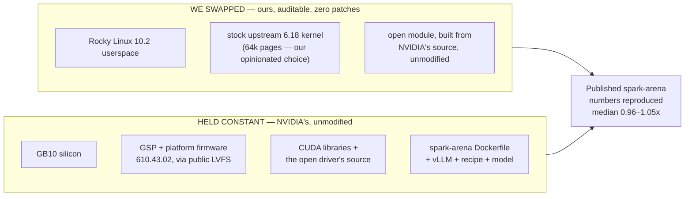

# A standard Rocky Linux stack runs NVIDIA's DGX Spark – at single-host inference parity, and you can confirm it yourself

> Rocky 10.2 + a stock upstream 6.18 kernel + the open NVIDIA 610 driver, on the GB10, reproduces the community's own [spark-arena.com](https://spark-arena.com) single-host benchmarks. Every host change is auditable, the stack stays current through stock public tooling, and the published numbers came back.

## The proof

A full `llama-benchy` matrix sweeps the whole performance surface – **decode** (single-user generation), **prefill** (prompt processing), and **concurrency** (throughput as users stack up). No single cell is "the" number; the honest summary is the **median vs 1.0× (parity)**. Decode lands at or just above parity, prefill below it (~0.75–0.93× at the `pp2048` cell across the three models).

| Model | Scope | Full-matrix median vs published |
|---|---|:---:|
| Qwen3.5-35B-A3B-FP8 | full 104-cell matrix | **1.01× – parity** |
| Qwen3.5-0.8B | full 104-cell matrix | **0.96× – parity** |
| gemma-3-1b-it | full 56-cell matrix (context-capped) | **1.05× – parity** |

Medians spanning **0.96×–1.05×** straddle parity, the signature of a transparent host swap. Raw per-cell numbers and the prefill/decode breakdown are committed: [`receipts/`](../../receipts/) · [`scoreboard.md`](scoreboard.md).

**Also reproduced – single-cell `tg128 (c1)` only; a parity claim requires the full matrix:**

| Model | Published (t/s) | Ours (t/s) | State |
|---|---:|---:|---|
| LFM2.5-350M | 222.8 | 246.0 | single cell – full matrix not yet run |
| gpt-oss-120b | 58.8 | 62.6 | single cell – **full matrix in progress** ⏳ ([#6](https://github.com/maxspevack/spark-rocky/issues/6)) |

## We changed only the host

The benchmark runs in a serving container built from the spark-arena project's **own Dockerfile, unmodified** (vLLM + the model + the spark-arena recipe). We swapped only the **host beneath it** – Rocky 10.2 + a stock 6.18 kernel + the open driver we built – and the host's `libcuda` is injected into that container at runtime. Same Dockerfile, same recipe, same GB10 silicon.

One variable still differs between the published run and ours: **the vLLM build, not the host.** spark-arena pins no runtime version, so the published entry and our run compiled vLLM on different dates.

## What the host actually is

Everything swapped in is stock, current, and built from source — the exact coordinates:

| Layer | This stack |
|---|---|
| OS | Rocky Linux 10.2 |
| Kernel | stock mainline **6.18.38** (64k pages; parity benched on 6.18.34/4k). *The shipped default has since moved to the CIQ Linux Kernel (`6.18.38-clk`, functionally validated on the GB10 — boot/driver/CUDA/managed-memory); the stock host these receipts were recorded on stays one pin-flip away (`KERNEL_SOURCE=kernelorg`).* |
| Driver | open NVIDIA **610.43.03**, built from source unmodified (parity benched on 610.43.02) |
| CUDA | **13.0** |

**CUDA — the layer that actually moves inference numbers — is held identical to the stack the published entries ran on**, so the reproduced parity is a property of the OS/kernel/driver swap, not a CUDA artifact. Parity is not superiority.

## Why it holds up

- ✅ **Auditable.** Every host change is a named `.config` symbol or build step – no `.patch`/`.diff` anywhere in the repo, and the open driver is built unmodified (`make … SYSSRC=… modules`, no source edits). Nothing hidden to carry or rot.
- ✅ **Firmware-current, the standard way.** The box runs the latest platform firmware NVIDIA publishes to the **public LVFS**, applied with stock `fwupd` – no DGX OS, no entitlement, no proprietary tool. The parity result carries no stale-firmware confound.
- ✅ **Stays current with a one-line change.** Bump the kernel pin in [`config/versions.env`](../../config/versions.env) and rebuild — `CLK_COMMIT` tracks the `ciq-6.18.y` branch (the shipped default; the drift sensor fires when it moves), and the stock-mainline `KVER` pin stays live as the A/B knob. Either way a kernel refresh is a pin change, not a patch-rebase that rots — this repo carries zero patches against either tree.

→ **Reproduce or refute any entry yourself, credential-free:** [`reproduce-pipeline.md`](reproduce-pipeline.md)
